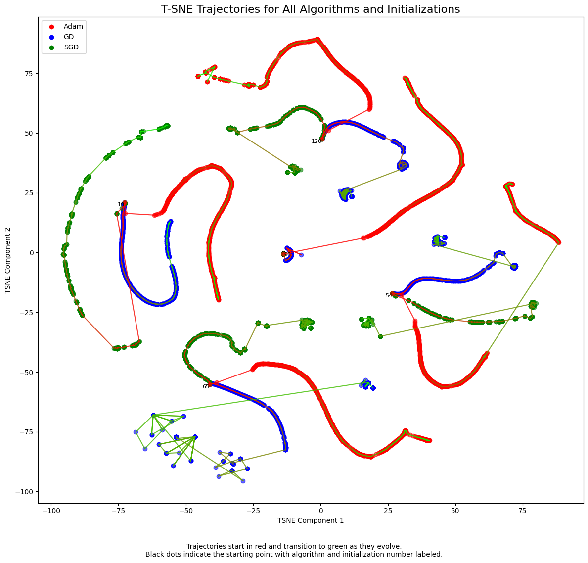
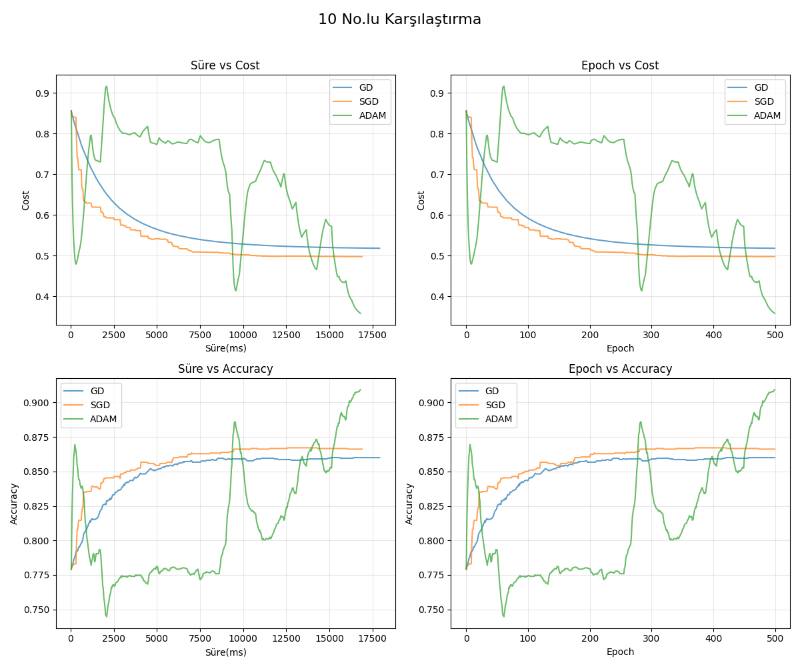

# NeuralC

**NeuralC**, C dilinde geliştirilmiş bir optimizasyon algoritmaları karşılaştırma aracıdır. **Gradient Descent (GD), Stochastic Gradient Descent (SGD) ve ADAM** algoritmalarını test eder, yorumlar ve sonuçlarını grafiksel olarak görselleştirir.

## ✨ Özellikler

- **GD, SGD ve ADAM Karşılaştırması**: Üç optimizasyon algoritmasının performans analizini yapar.
- **Grafiksel Çıktı (Plot)**: Sonuçları grafik formatında gösterir.
- **C Dili ile Hızlı ve Hafif Çalışma**: Minimum bağımlılık ile yüksek performans.
- **Yorumlama ve Analiz**: Optimizasyon süreçlerini detaylı olarak analiz eder.

## ✅ Çıktılar

- **TSNE Çıktısı**: Algoritmaların parametlerelinin değişimini gösterir.

- **Süre/Cost, Epoch/Cost, Süre/Accuracy, Epoch/Accuracy**: Süre, Cost, Epoch ve Accuracy karşılaştırmaları.


## 🛠️ Kurulum ve Çalıştırma

### Gereksinimler
- CMake
- C derleyicisi (GCC, Clang veya MSVC)

### Derleme ve Çalıştırma
1. Proje dosyalarını indirin veya klonlayın:
   ```sh
   git clone https://github.com/ensargx/NeuralC.git
   cd NeuralC
   ```
2. CMake ile projeyi oluşturun ve derleyin:
   ```sh
   mkdir build && cd build
   cmake ..
   make
   ```
3. Programı çalıştırın:
   ```sh
   ./neuralc
   ```

### Alternatif: Derlenmiş Sürümü Kullanma
1. **Releases** bölümünden en son sürümü indirin: [GitHub Releases](https://github.com/ensargx/NeuralC/releases)
2. İndirilen çalıştırılabilir dosyayı terminalde çalıştırın:
   ```sh
   ./neuralc
   ```

## 🔧 Kullanım

1. Algoritmaları karşılaştırmak için programı çalıştırın.
2. **Veri seti yolları**:
   - Eğitim verileri: `data/data_train_x.csv`, `data/data_train_y.csv`
   - Test verileri: `data/data_test_x.csv`, `data/data_test_y.csv`
3. Sonuçlar **gnuplot** kullanılarak grafiksel olarak gösterilecektir.
4. Analiz çıktıları terminalde görüntülenir.

---
